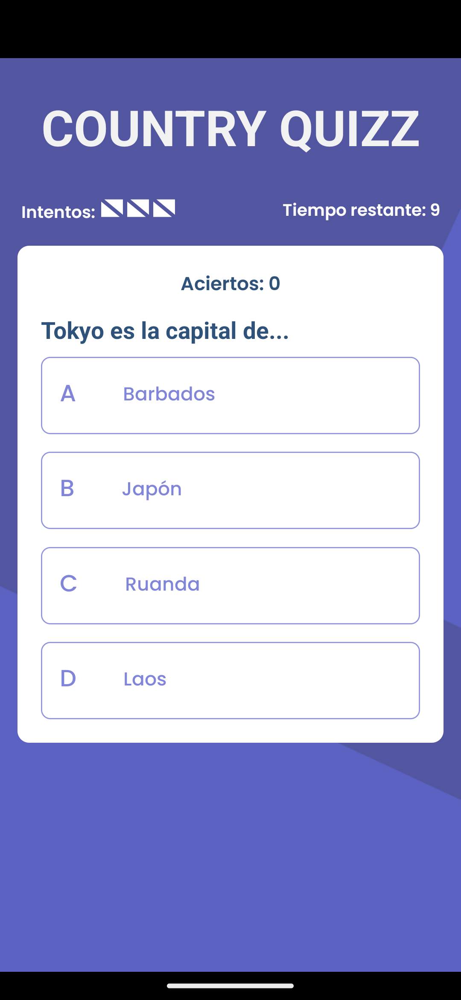
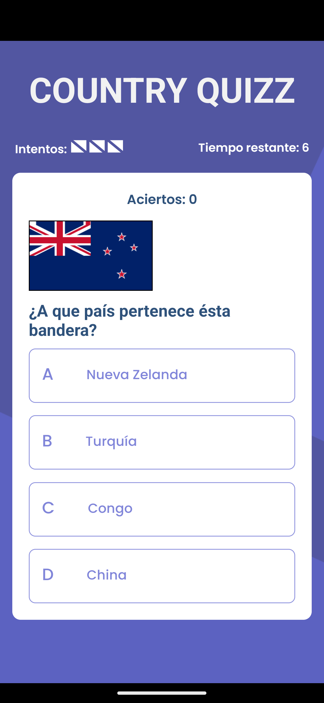
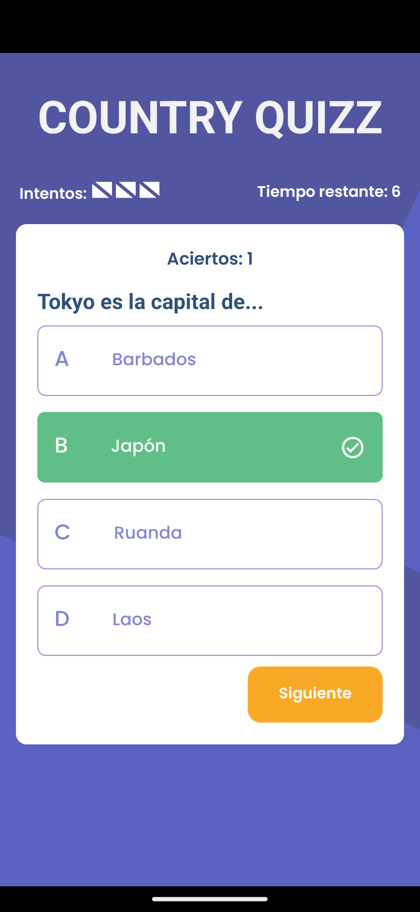
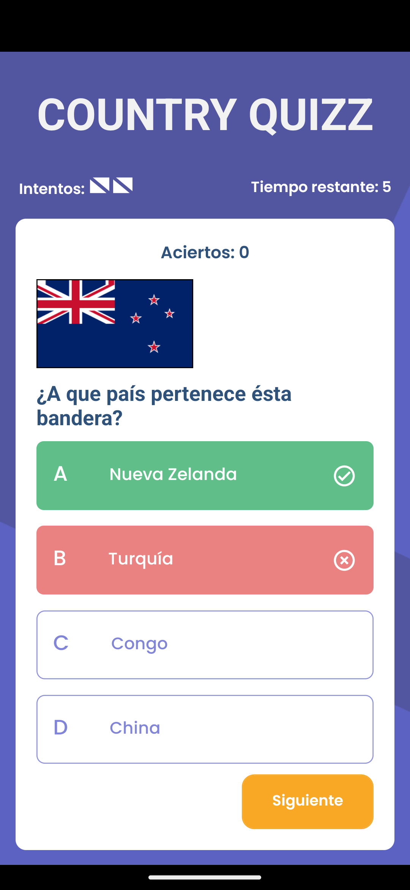

# Country Quizz App - React Native

Download [App]

## SCREENSHOTS

### Screens

    
    
    
    

### Game States

    
    

[App]: https://expo.dev/accounts/jotazo/projects/country_challenges_app/builds/998b9d7e-9f73-431c-a7f1-89a885929d30